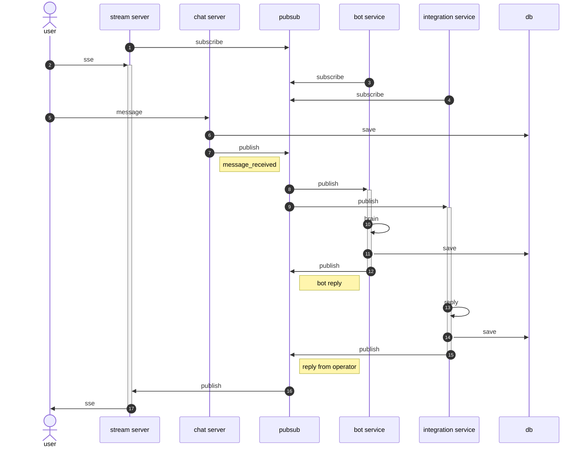

# chat-ex

This project was generated using [Nx](https://nx.dev).

The most powerful chat system i've ever come up with.

## features

- eslint import order
- tailwind
- scss
  - nx stylelint
  - typed scss modules
- pubsub
  - redis
- react
  - mfe
- nestjs
  - hot reload
- bunyan
- mongoose
- redux toolkit

## directory structure

```zsh
apps/
  admin/
    frontend/
      shell/ # project(mfe)
      account/ # project(mfe-remote)
      ...
    backend/ # project

  chat/
    ...
    frontend/ # project
    backend/ # project

  services/
    account/ # project
    chat/ # project
    ...

libs/
  admin/
    frontend/
      components/
        {feature} # project
      state/ # project
      shared/ # project
    backend/
      modules/ # nest module
        {feature} # project
      shared/ # project
  chat/
    ...
  shared/
    api/ # project
    data/ # project
    state/ # project
    utils/ # project

```


